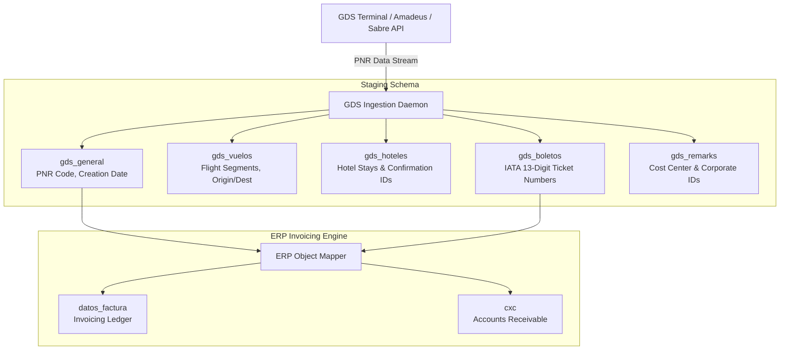

# ✈️ Module 2: Global Distribution System (GDS) PNR Ingestion Pipeline

## 1. Overview & Data Flow Architecture

The GDS Interface engine automatically imports passenger reservation files (PNRs - Passenger Name Records) from GDS platforms (Amadeus, Sabre, Travelport) and transforms unformatted reservation data into structured financial ledger entries.

---

## 2. Staging Pipeline Components

### 2.1 PNR Header (`gds_general`)
Pointers for every imported PNR session.
- `pnr_code`: 6-character alphanumeric Record Locator (e.g., `X7K2P9`).
- `creation_date`: Timestamp of reservation creation.
- `agent_sine`: Sine code of booking agent.

### 2.2 Flight Segments (`gds_vuelos`)
Stores itinerary leg details.
- `origin`: 3-letter IATA airport code (e.g., `MEX`).
- `destination`: 3-letter IATA airport code (e.g., `CUN`).
- `airline_code`: 2-character IATA airline code (e.g., `AM`).
- `flight_number`: Flight number string.

### 2.3 Ticket Numbers (`gds_boletos`)
Contains 13-digit IATA electronic ticket numbers.
- `ticket_number`: Full ticket sequence (e.g., `1392405829102`).
- `passenger_name`: Traveler name string.
- `bsp_code`: 3-digit IATA airline prefix.
